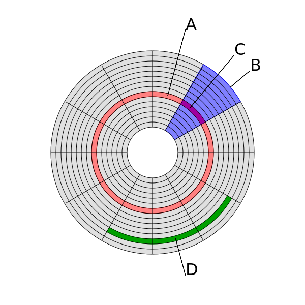

## KiB or KB
- KiB = kibibyte = kilo binary byte
- KB  = kilo byte

 

 

## sector
- See C in figure 1
- A sector is a subdivision of a track on a magnetic disk or  
  optical disc. Each sector stores a fixed amount of user-accessible  
  data, traditionally 512 bytes for hard disk drives (HDDs)  
  and 2048 bytes for CD-ROMs and DVD-ROMs. Newer HDDs use  
  4096-byte (4 KiB) sectors, which are known as the Advanced Format (AF).
- The sector is the minimum storage unit of a hard drive.
  

 

## cluster
- See D in figure 1
- In computer file systems, a cluster (sometimes also called  
  allocation unit or block) is a unit of disk space allocation  
  for files and directories.
- To reduce the overhead of managing on-disk data structures,  
  the filesystem does not allocate individual disk sectors  
  by default, but contiguous groups of sectors, called clusters.