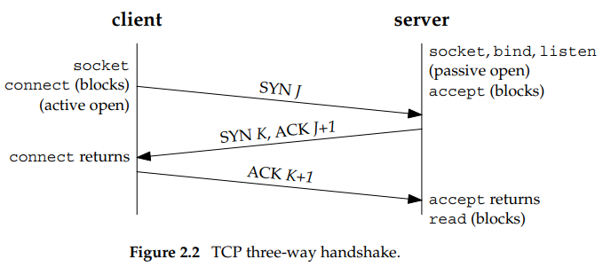
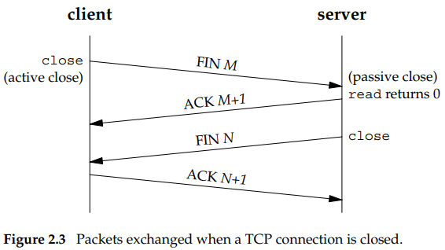
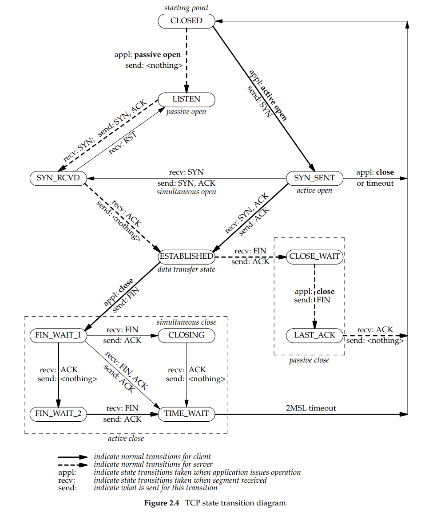
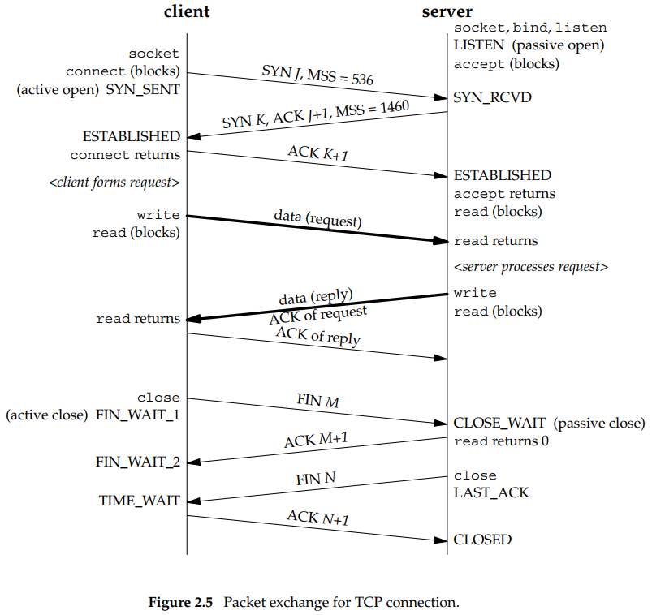

## Contents

- [Contents](#contents)
- [Three-way handshake](#three-way-handshake)
- [TCP Options](#tcp-options)
- [TCP Connection Termination](#tcp-connection-termination)
- [TCP State Transition Diagram](#tcp-state-transition-diagram)
  - [Watch packets](#watch-packets)
- [TIME_WAIT State](#time_wait-state)

## Three-way handshake
  
1. The server must be prepared to accept an incoming connection.  
  This is normally done by calling socket, bind, and listen and
  is called a passive open.  
2. The client issues an active open by calling connect. This 
  causes the client TCP to send a ‘‘synchronize’’ (SYN) segment,
  which tells the server the client’s initial sequence number 
  for the data that the client will send on the connection. 
  Normally, there is no data sent with the SYN; it just contains
  an IP header, a TCP header, and possible TCP options 
  (which we will talk about shortly).  
3. The server must acknowledge (ACK) the client’s SYN and the 
  server must also send its own SYN containing the initial 
  sequence number for the data that the server will send on the  
  connection. The server sends its SYN and the ACK of the client’s  
  SYN in a single segment.  
4. The client must acknowledge the server’s SYN.
## TCP Options
Each SYN can contain TCP options. Commonly used options include the following:
- MSS option
  - With this option, the TCP sending the SYN announces its  
  maximum segment size, the maximum amount of data that it  
  is willing to accept in each TCP segment, on this  
  connection. The sending TCP uses the receiver’s MSS value  
  as the maximum size of a segment that it sends. We will  
  see how to fetch and set this TCP option with the  
  *TCP_MAXSEG* socket option.
- Window scale option
  -  The maximum window that either TCP can advertise to the other TCP is 65,535, because the corresponding field in the TCP header occupies 16 bits. But, high-speed connections, common in today’s Internet (45 Mbits/sec and faster, as described in RFC 1323 [Jacobson, Braden, and Borman 1992]), or long delay paths (satellite links) require a larger window to obtain **the maximum throughput** possible. This newer option specifies that the advertised window in the TCP header must be scaled (left-shifted) by 0–14 bits, providing a maximum window of almost one gigabyte (65, 535 × 214). Both end-systems must support this option for the window scale to be used on a connection. We will see how to affect this option with the *SO_RCVBUF* socket option.  
- Timestamp option. 
  - This option is needed for high-speed connections to prevent possible data corruption caused by old, delayed, or duplicated segments. Since it is a newer option, it is negotiated similarly to the window scale option. As network programmers there is nothing we need to worry about with this option.  
  
## TCP Connection Termination 
  

 

While it takes three segments to establish a connection,  
it takes four to terminate a connection.
- One application calls close first, and we say that this end  
  performs the active close. This end’s TCP sends a FIN segment,  
  which means it is finished sending data.
- The other end that receives the FIN performs the passive close. The received FIN is acknowledged by TCP. The receipt of the FIN is also passed to the application as an end-of-file (after any data that may have already been queued for the application to receive), since the receipt of the FIN means the application will
not receive any additional data on the connection.
- Sometime later, the application that received the end-of-file will close its socket. This causes its TCP to send a FIN.
- The TCP on the system that receives this final FIN (the end that did the active close) acknowledges the FIN.

 

## TCP State Transition Diagram

### Watch packets

- It is important to notice in Figure 2.5 that if the entire purpose of this connection
was to send a one-segment request and receive a one-segment reply, there would be
eight segments of overhead involved when using TCP. If UDP was used instead, only
two packets would be exchanged: the request and the reply. But switching from TCP to
UDP removes all the reliability that TCP provides to the application, pushing lots of
these details from the transport layer (TCP) to the UDP application. Another important
feature provided by TCP is **congestion control**, which must then be handled by the UDP
application.

 

## TIME_WAIT State
- the time value = maximum segment lifetime (MSL), sometimes called 2MSL.
- The MSL is the maximum amount of time that any given IP datagram can live in a network. We know this time is bounded because every datagram contains an 8-bit hop limit with maximum value of 255. Although this is a hop limit and not a true time limit, the assumption is made that a packet with the maximum hop limit of 255 cannot exist in a network for more than MSL seconds.
- two reasons:
  - To implement TCP’s full-duplex connection termination reliably.
  - To allow old duplicate segments to expire in the network.

