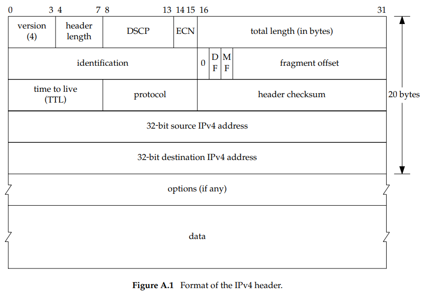
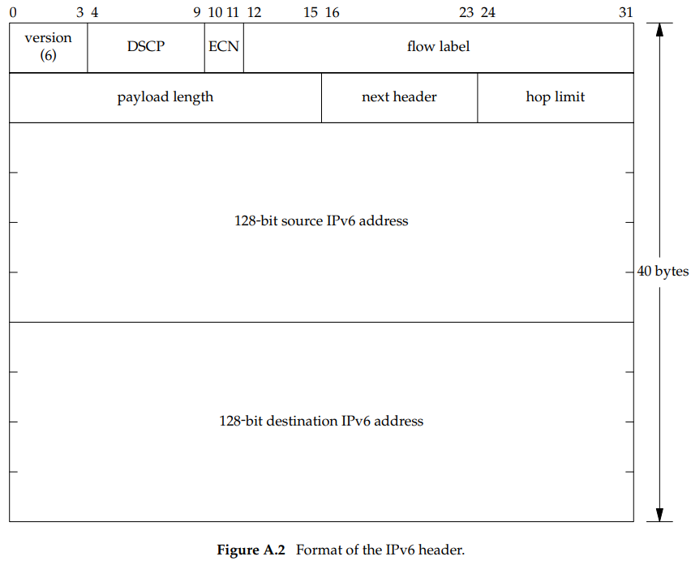
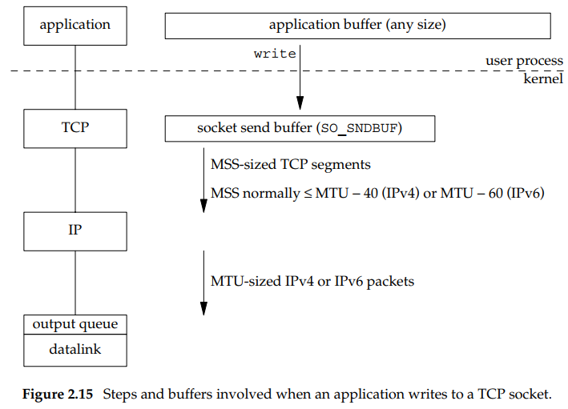
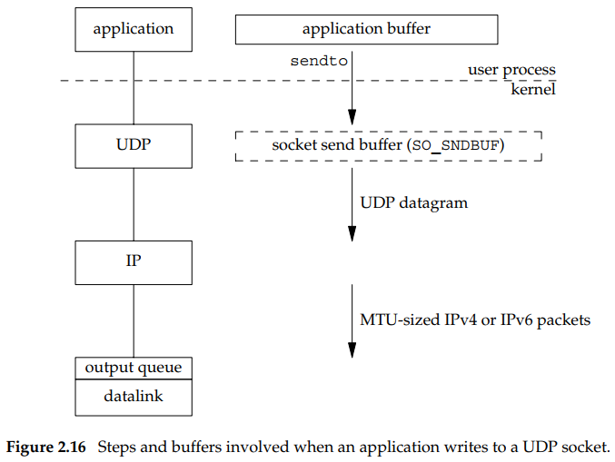
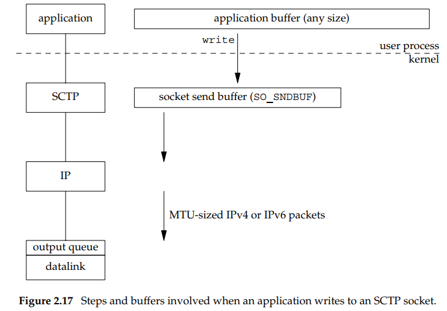

## IP Buffer sizes and limitations
- The **maximum size of an IPv4 datagram** is 65,535 bytes,  
  including the IPv4 header. This is because of the 16-bit   
  total length field.  

- The **maximum size of an IPv6 datagram** is 65,575 bytes,  
  including the 40-byte IPv6 header. This is because of the   
  16-bit payload length field. Notice that the IPv6 payload   
  length field does not include the size of the IPv6 header,   
  while the IPv4 total length field does include the header   
  size. IPv6 has a jumbo payload option, which extends the   
  payload length field to 32 bits, but this option is supported  
  only on datalinks with a maximum transmission unit (MTU)   
  that exceeds 65,535.  

- Many networks have a **MTU** which can be dicated by the hardware.
  For example. the Ethernet MTU is 1500 bytes. Other datalinks,
  such as point-to-point links using the point-to-point protocol(PPP),
  have configurable MTU. Older SILP links often used an MTU of 1006
  or 296 bytes.
- **#minimum MTU**  
  The minimum link MTU for IPv4 is 68 bytes. This permits a  
  maximum-sized IPv4 header (20 bytes of fixed header, 30  
  bytes of options) and minimum-sized fragment (the fragment   
  offset is in units of 8 bytes).   
  The minimum link MTU for IPv6 is 1,280 bytes. IPv6 can run  
  over links with a smaller MTU, but requires link-specific  
  fragmentation and reassembly to make the link appear to have  
  an MTU of at least 1,280 bytes.  
- **#path MTUs between two host are different**   
  The smallest MTU in the path between two hosts is called the path MTU.  
  Today, the Ethernet MTU of 1,500 bytes is often the path MTU.   
  The path MTU need not be the same in both directions between   
  any two hosts because **routing in the Internet is often asymmetric.**  
  That is, the route from A to B can differ from the route from B to A.  
- **#fragmentation**  
  When an IP datagram is to be sent out an interface, if the  
  size of the datagram exceeds the link MTU, fragmentation is   
  performed by both IPv4 and IPv6. The fragments are not normally   
  reassembled until they reach the final destination. IPv4 hosts  
  perform fragmentation on datagrams that they generate and IPv4   
  routers perform fragmentation on datagrams that they forward.   
  But with IPv6, only hosts perform fragmentation on datagrams   
  that they generate; IPv6 routers do not fragment datagrams  
  that they are forwarding.  
- **#DF set**
  - **#ipv4** If the ‘‘don’t fragment’’ (DF) bit is set in  
  the IPv4 header, it specifies that this datagram  
  must not be fragmented, either by the sending host or by any  
  router. A router that receives an IPv4 datagram with the  
  DF bit set whose size **exceeds the outgoing link’s MTU**   
  generates an ICMPv4 ‘‘destination unreachable,   
  fragmentation needed but DF bit set’’ error message.  
  - **#ipv6** Since IPv6 routers do not perform fragmentation,  
  there is an implied DF bit with every IPv6 datagram.   
  When an IPv6 router receives a datagram whose size exceeds  
  the outgoing link’s MTU, it generates an ICMPv6 ‘‘packet  
  too big’’ error message
  - **#path MTU discovery**  For example, if TCP uses this technique  
  with IPv4, then it sends all its datagrams with the DF bit  
  set. If some intermediate router returns an ICMP  
  ‘‘destination unreachable, fragmentation needed but  
  DF bit set’’ error, TCP decreases the amount of data it  
  sends per datagram and retransmits. Path MTU discovery is  
  optional with IPv4, but IPv6 implementations all either  
  support path MTU discovery or always send using the  
  minimum MTU.
- **#minimum reassembly buffer size**  
  the minimum datagram  
  size that we are guaranteed any implementation must support.  
  For IPv4, this is 576 bytes. IPv6 raises this to 1,500  
  bytes. With IPv4, for example, we have no idea whether a   
  given destination can accept a 577-byte datagram or not.  
  Therefore, many IPv4 applications that use UDP  
  (e.g., DNS, RIP, TFTP, BOOTP, SNMP) prevent applications  
  from generating IP datagrams that exceed this size.
- **#maximum segment size(MSS)**  
  that announces to the peer TCP the maximum amount of TCP  
  data that the peer can send per segment. We saw the MSS  
  option on the SYN segments. **The goal of the MSS is to   
  tell the peer the actual value of the reassembly buffer  
  size and to try to avoid fragmentation.** 
  The MSS is often set to the interface MTU minus the fixed  
  sizes of the IP and TCP headers. On an Ethernet using   
  IPv4, this would be 1,460, and on an Ethernet using IPv6,  
  this would be 1,440. (The TCP header is 20 bytes for   
  both, but the IPv4 header is 20 bytes and the IPv6   
  header is 40 bytes.) 
  The MSS value in the TCP **MSS option is a 16-bit field**,  
  limiting the value to 65,535. This is fine for IPv4,  
  since the maximum amount of TCP data in an IPv4 datagram  
  is 65,495 (65,535 minus the 20-byte IPv4 header and minus  
  the 20-byte TCP header). But with the IPv6 jumbo payload  
  option, a different technique is used (RFC 2675 [Borman, Deering, and Hinden 1999]). First, the maximum amount of TCP data in  
  an IPv6 datagram without the jumbo payload option is  
  65,515 (65,535 minus the 20-byte TCP header). Therefore,  
  **the MSS value of 65,535 is considered a special case   
  that designates ‘‘infinity.’’** This value is used only if  
  the jumbo payload option is being used, which requires an  
  MTU that exceeds 65,535. If TCP is using the jumbo  
  payload option and receives an MSS announcement of   
  65,535 from the peer, the limit on the datagram sizes  
  that it sends is just the interface MTU. If this turns  
  out to be too large (i.e., there is a link in the path  
  with a smaller MTU), then path MTU discovery will determine  
  the smaller value.

 

## TCP Output

- Real have socket send buffer allocate.
- only ACK and then discard data.
- the MSS is the value announced by the peer, or 536 if  
  the peer did not send an MSS option.
- Each datalink has an output queue, and if this queue is  
  full, the packet is discarded and an error is returned  
  up the protocol stack: from the datalink to IP and then  
  from IP to TCP. TCP will note this error and try sending  
  the segment later. The application is not told of this  
  transient condition.

 

## UDP Output

- do not have **SEND BUFF**
- add datagram to outqueue, if there is no room on the queue for  
  the datagram or one of its fragments, ENOBUFS is often returned  
  appplication. 

 

## SCTP Output

- like tcp
