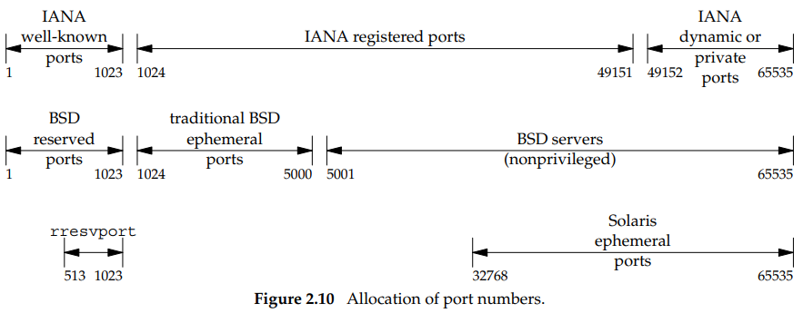

## PORT ASSIGNMENT

- Unix systems have the concept of a reserved port, which is any port less than
1024. These ports can only be assigned to a socket by an appropriately privileged process. All the IANA well-known ports are reserved ports; hence, the server allocating this port (such as the FTP server) must have superuser privileges when it starts.