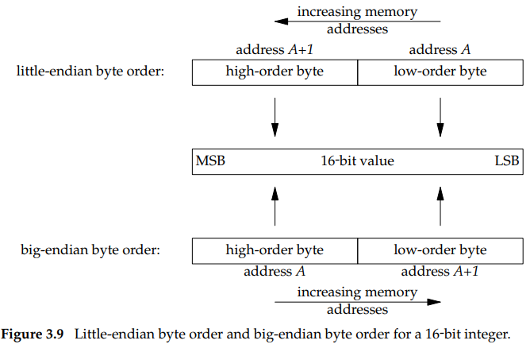

## Byte Ordering Function
- intro byte order
  
- **#byte order** : The terms ‘‘little-endian’’ and ‘‘big-endian’’  
  indicate which end of the multibyte value, the little end  
  or the big end, is stored at the starting address of the value.
- **#byte order function**

```c++
#include <netinet/in.h>
    uint16_t htons(uint16_t host16bitvalue);
    uint32_t htonl(uint32_t host32bitvalue);
        //Both return: value in network byte order
    uint16_t ntohs(uint16_t net16bitvalue);
    uint32_t ntohl(uint32_t net32bitvalue);
        //Both return: value in host byte order
```
<p></br></p>

## Byte Manipulation Functions
- There are two groups of functions that operate on multibyte  
  fields, without interpreting the data, and without assuming  
  that the data is a null-terminated C string.

```c++
    #include <strings.h>
    void bzero(void *dest, size_t nbytes);
    void bcopy(const void *src, void *dest, size_t nbytes);
    int  bcmp(const void *ptr1, const void *ptr2, size_t nbytes);
                        // Returns: 0 if equal, nonzero if unequal
    #include <string.h>
    void *memset(void *dest, int c, size_t len);
    void *memcpy(void *dest, const void *src, size_t nbytes);
    int   memcmp(const void *ptr1, const void *ptr2, size_t nbytes);
                        // Returns: 0 if equal, <0 or >0 if unequal
```
<p></br></p>

## Net Address Convesion
- **#ipv4 addression conversion** They convert Internet  
  addresses between ASCII strings and network byte ordered binary  
  values.  
  ```c++
    #include <arpa/inet.h>
    int inet_aton(const char *strptr, struct in_addr *addrptr);
        //Returns: 1 if string was valid, 0 on error
    in_addr_t inet_addr(const char *strptr);
        //Returns: 32-bit binary network byte ordered IPv4 address; INADDR_NONE if error deprecated
    char *inet_ntoa(struct in_addr inaddr);
        //Returns: pointer to dotted-decimal string which is not reentrant
  ```
- **#ipv4/v6 addression conversion**  
  ```c++
    #include <arpa/inet.h>
    #define INET_ADDRSTRLEN 16 /* for IPv4 dotted-decimal */
    #define INET6_ADDRSTRLEN 46 /* for IPv6 hex string */
    int inet_pton(int family, const char *strptr, void *addrptr);
        // Returns: 1 if OK, 0 if input not a valid presentation format, −1 on error
    const char *inet_ntop(int family, const void *addrptr, char *strptr, size_t len);
        // Returns: pointer to result if OK, NULL on error
  ```