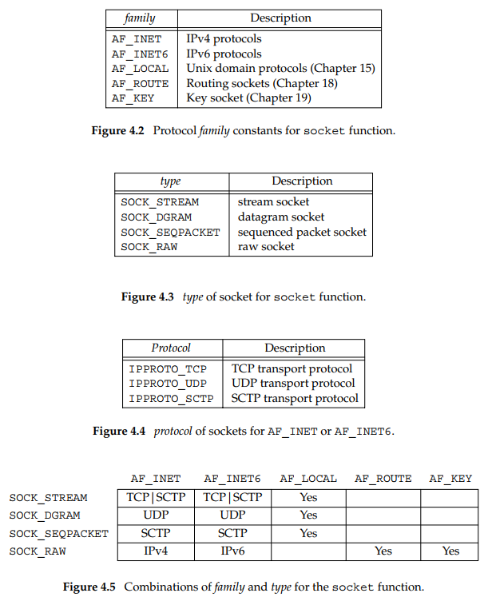

## socket
```c++
    #include <sys/socket.h>  
    int socket(int family, int type, int protocol);  
            //Returns: non-negative descriptor if OK, −1 on error  
```
- family 
  specifies the protocol family.  
  AF_XXX VS PF_XXX:  
  ‘‘AF_’’ prefix stands for  
  ‘‘address family’’
  ‘‘PF_’’ prefix stands for 
  ‘‘protocol family.’’  
  Historically, the intent was that a single protocol family might  
  support multiple address families and that the PF_ value was used  
  to create the socket and the AF_ value was used in socket address  
  structures. 
- type  
  the specific socket type
- protocol  
  the specific protocol type



## getsockname and getpeername
```c++
  #include <sys/socket.h>
  int getsockname(int sockfd, struct sockaddr *localaddr, socklen_t *addrlen);
  int getpeername(int sockfd, struct sockaddr *peeraddr, socklen_t *addrlen);
  //Both return: 0 if OK, −1 on error
```

- We call getsockname and return the address family. Since the POSIX 
  specification allows a call to getsockname on an unbound socket, 
  this function should work for any open socket descriptor.